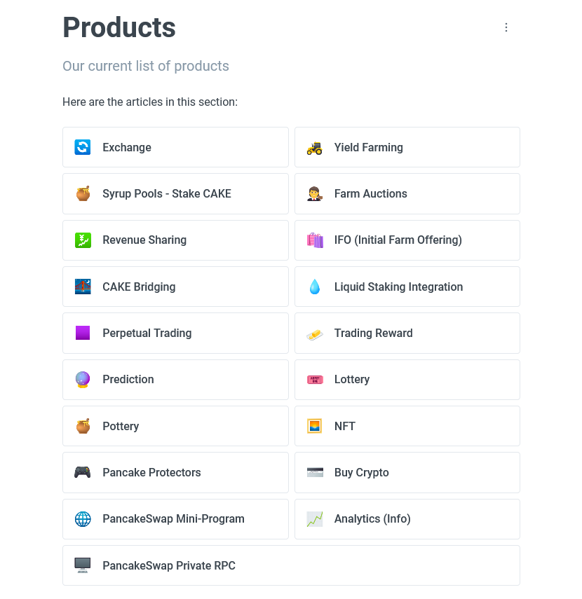

# PancakeSwap

PancakeSwap is a decentralized exchange (DEX) that runs on the Binance Smart Chain (BSC). It allows users to trade tokens without the need for a central authority.

## Products <a href="#products-and-services" id="products-and-services"></a>

PancakeSwap offers a wide range of products, including:

<table data-card-size="large" data-view="cards"><thead><tr><th></th><th data-hidden data-card-target data-type="content-ref"></th></tr></thead><tbody><tr><td><strong>🔄 Exchange</strong></td><td><a href="product/exchange/">exchange</a></td></tr><tr><td>Yield Farming</td><td></td></tr><tr><td></td><td></td></tr></tbody></table>

<figure><figcaption><p><a href="https://docs.pancakeswap.finance/products">Product and services</a></p></figcaption></figure>

```
// Some code
```
