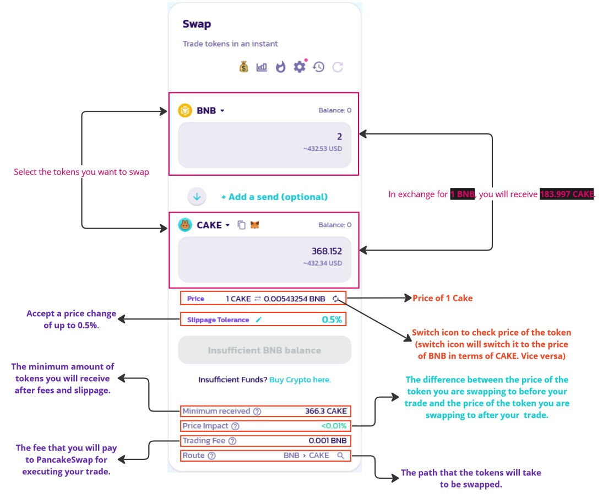

# Token Swaps

Token swaps on PancakeSwap offer a straightforward method for exchanging one cryptocurrency for another using automated liquidity pools on the <mark style="color:purple;">BNB Smart Chain</mark>, <mark style="color:purple;">Ethereum</mark>, and <mark style="color:purple;">Aptos</mark> networks.\
\
The PancakeSwap token swap UI is located at the following URL: [https://pancakeswap.finance/swap](https://pancakeswap.finance/swap)

<figure><figcaption><p>Breakdown pancakeswap</p></figcaption></figure>

Once you have navigated to the swap UI, you will see two dropdown menus where you can select the tokens you want to exchange. The first dropdown menu allows you to select the token you want to swap from, and the second dropdown menu allows you to select the token you want to swap to.

Once you have selected the tokens you want to exchange, you can enter the amount of the token you want to trade in the "Amount" field. You will then see the following information:

## Slippage Tolerance

If you swap `2 BNB` for `368.152 CAKE`, the slippage tolerance is `0.5%`. This means that you are willing to accept a price change of up to `0.5%` between the time you enter the amount you want to swap and the time your trade is executed.

For example:

if you swap `2 BNB` for `368.152 CAKE` and the price of CAKE changes by `0.5%`, then you will receive between `366.154 CAKE` and `369.15 CAKE` in exchange for your `2 BNB`.

The slippage tolerance is a safety measure to protect you from sudden price changes. If the price of `CAKE` changes by more than `0.5%` between the time you enter the amount you want to swap and the time your trade is executed, then the trade will not be executed.

To calculate the minimum and maximum amount of `CAKE` that you will receive in exchange for `2 BNB`, we can use the following formula:

```
Minimum CAKE received = Price of CAKE * (1 - Slippage tolerance)
Maximum CAKE received = Price of CAKE * (1 + Slippage tolerance)
```

**Example:**

* Price of CAKE = `184.076 CAKE per BNB`
* Slippage tolerance = `0.5%`

**Minimum CAKE received:**

```
184.076 CAKE per BNB * (1 - 0.5%) = 366.31124 CAKE
```

**Maximum CAKE received:**

```
184.076 CAKE per BNB * (1 + 0.5%) = 369.99276 CAKE
```

Therefore, the minimum amount of `CAKE` that you will receive is `366.31124 CAKE` and the maximum amount of `CAKE` that you will receive is `369.99276 CAKE`.

**Conclusion:** The <mark style="color:orange;">slippage tolerance</mark> is just a maximum amount. The actual price change may be less than the slippage tolerance. This is because the price of an asset can fluctuate rapidly, and the trade execution may take a few seconds or even minutes to complete. During this time, the price of the asset may move in your favor, resulting in a smaller price change than you expected.

## Price Impact

The price impact in the above image is less than `0.01%` because the trade is relatively small. The price impact is calculated based on the size of your trade and the liquidity of the tokens you are swapping. For larger trades or trades involving tokens with low liquidity, the price impact will be higher.

The calculation for the price impact is as follows:

```
Price impact = (Price after trade - Price before trade) / Price before trade * 100%
```

In above example, the price of `CAKE` before the trade is `184.076 CAKE per BNB`. The price of CAKE after the trade will be slightly higher due to the price impact. However, for a trade of `2 BNB`, the price impact will be very small.

The price impact is displayed in the PancakeSwap portal to help users understand how their trade will affect the price of the tokens they are swapping. Users should try to choose the time of day and the amount of tokens they are swapping to minimize the price impact.

**Note:** The price impact is just an estimate. The actual price impact may be slightly different depending on the market conditions.

**Calculation of price impact:**

```
Price of CAKE before trade = 184.076 CAKE per BNB
Price of CAKE after trade = 184.11 CAKE per BNB (estimated)

Price impact = (184.11 CAKE per BNB - 184.076 CAKE per BNB) / 184.076 CAKE per BNB * 100% = 0.018%
```

Therefore, the price impact for the trade in the image is estimated to be `0.018%`. This is a very small price impact, which is why the PancakeSwap portal is displaying it as less than `0.01%`.

## Trading Fee

<figure><figcaption></figcaption></figure>

The trading fee in the image is `0.001 BNB`, which is less than `0.01%` of the total trade value. This means that you will pay `0.001 BNB` for every `100 BNB` worth of tokens that you trade.

The trading fee is charged to compensate the liquidity providers who provide the liquidity for the trading pool.

The trading fee is also used to fund the development of PancakeSwap and its ecosystem.

If the trader is swapping `1 CAKE` for `0.00543254 BNB`. The trading fee of `0.001 BNB` will be deducted from the amount of `BNB` that the trader receives. Therefore, the trader will actually receive `0.00443254 BNB` after the trade is executed.

<mark style="color:red;">For Exchange V3 liquidity pools, there are currently four different fee tiers: 0.01%, 0.05%, 0.25%, and 1%.</mark>

<mark style="color:red;">For StableSwap liquidity pools, the fee rate depends on the individual pool configurations. Please check the “Fee” section for more detail.</mark>

<mark style="color:red;">For Exchange V2 liquidity pools, a fixed 0.25% trading fee is applied, which is broken down as follows:</mark>

* <mark style="color:red;">**0.17%**</mark> <mark style="color:red;"></mark><mark style="color:red;">- Returned to Liquidity Pools in the form of a fee reward for liquidity providers.</mark>
* <mark style="color:red;">**0.0225%**</mark> <mark style="color:red;"></mark><mark style="color:red;">- Sent to the PancakeSwap Treasury.</mark>
* <mark style="color:red;">**0.0575%**</mark> <mark style="color:red;"></mark><mark style="color:red;">- Sent towards CAKE buyback and burn.</mark>

## Route

The route is the path that your trade will take to get from the token you are swapping from to the token you are swapping to.

<figure><figcaption></figcaption></figure>

[Route is automatically calculated based on your routing preference to achieve the best price for your trade .](#user-content-fn-1)[^1]

PancakeSwap finds the best way to trade your tokens by considering how much of each token is available to trade (liquidity) and how much each way to trade costs (fees), using its [<mark style="color:orange;">Smart Router</mark>](#user-content-fn-2)[^2] to access liquidity and pricing from multiple pools.

When you make a token swap (trade) on the [BNB Smart Chain](https://pancakeswap.finance/swap?chain=bsc) or [Ethereum](https://pancakeswap.finance/swap?chain=eth) PancakeSwap Exchange, you pay trading fees based on the type of liquidity pool your trade is routed through. You can check the route details by clicking the magnifier icon on the "Route" section.

PancakeSwap can route trades in multiple ways, such as:

#### **1. Direct swaps**

This is the simplest type of route, where the trade is executed in a single liquidity pool.

<figure><figcaption><p>direct swap</p></figcaption></figure>

The Smart Router has chosen a direct swap route through a single liquidity pool. This is because the Smart Router has determined that this route is the most efficient way to execute the trade, given the current market conditions.

<figure><figcaption></figcaption></figure>

<figure><figcaption></figcaption></figure>

#### **2. Multi-hop swaps**

Multi-hop swaps involve swapping the input tokens through multiple liquidity pools in order to get the best price.&#x20;

<div data-full-width="false">

<figure><figcaption></figcaption></figure>

</div>

The route is `BNB > ETH > CAKE`, which means that you can trade `BNB` for `ETH` , and then `ETH` for `CAKE`.

<figure><figcaption></figcaption></figure>

PancakeSwap uses a <mark style="color:orange;">smart router</mark> to find the best exchange rates across multiple liquidity pools. This means that you can often get a better price for `CAKE` by trading through `ETH` first, rather than trading directly from `BNB` to `CAKE`.

#### **3. Split routing**

Split routing means that the trade is executed through multiple liquidity pools, but some of the liquidity is sourced from direct swaps and some is sourced from multi-hop swaps.

<figure><figcaption></figcaption></figure>

In this specific example, `50%` of the trade is executed through a single liquidity pool (direct swap) and `50%` of the trade is executed through multiple liquidity pools (multi-hop swap).

Here is a breakdown of what is happening in above image:

* The Smart Router has found two routes for the trade:
  * Route 1: Direct swap through a single liquidity pool.
  * Route 2: Multi-hop swap through multiple liquidity pools.
* The Smart Router has determined that the best route for the trade is a split route, where 50% of the trade is executed through Route 1 and 50% of the trade is executed through Route 2.

<figure><figcaption></figcaption></figure>

[^1]: This means that when you place a trade on a crypto exchange, the exchange will automatically calculate the best route to execute your trade based on your routing preferences. Your routing preferences may include factors such as price, speed, and liquidity.

[^2]: It is algorithm that executes trades across multiple pools to find the best price for traders.
